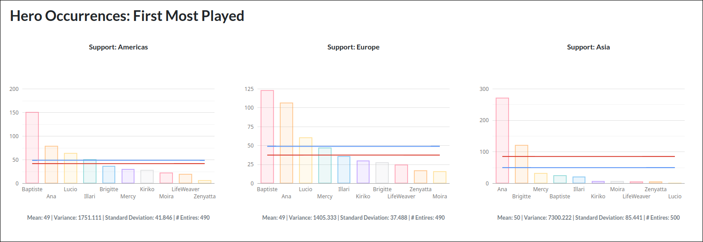

# Top 500 Aggregator

[Top 500 aggregator](https://t500-aggregator.aryankothari.dev) is a set of tools and website I created to evaluate raw data available in the game. This project utilizes a neural network to extract hero data from the top 500 leaderboards. 


The image above is a screenshot of a page in the in-game leaderboard. The area with the little pictures, on the right side of the image, are heroes. Each player, while playing the game, accumulates a "time played" for each hero. The top 500 leaderboard shows the top 3 heroes by playtime for each player on the leaderboard. This is the data being extracted. 

This data was extracted from the game using a neural network. The neural network was a contribution from an associate, who is mentioned in the [Github repository](https://github.com/thearyadev/top500-aggregator) for this project. 

The neural network is structured as follows:
```
model.add(Layer_Dense(X.shape[1], 128))
model.add(Activation_ReLU())
model.add(Layer_Dense(128, 128))
model.add(Activation_ReLU())
model.add(Layer_Dense(128, 40))  # second parameter is the number of classes
model.add(Activation_Softmax())
```
## Challenges

### Hero Classification

Starting this project, I attempted to use a formula-based approach to extract the hero data. This approach lead to low accuracy in the data extracted. I'm not an expert on this topic, and this project was a learning experience for me. I tried many methods for static comparisons, such as peak signal-to-noise ratio comparison, histogram comparison, and mean squared average (subtraction). All of these comparison methods resulted in a very low accuracy. I very quickly discarded these methods and moved on to a neural network approach.

The neural network is trained on a very simple dataset. The dataset consists of testing and training data, with around 40 images per class. The images are taken directly from the top 500 leaderboards. This is a very small dataset, but it is enough to train the neural network to recognize the heroes, as the images being compared are similar if not identical.

In hindsight, I believe it may have been possible to use a formula-based approach, by using pre-processing and image manipulation techniques. At the time of this project, I was not aware of these techniques. That being said, a neural network is still a suitable approach, and it is a very interesting topic to learn about.

### Conveying Data

In my opinion, the most important part of this project was conveying the data in a way that was easy to consume. This was challenging because of the scale of the data and the number of categories (charts) that needed to be displayed. 

In this project, I used Google Charts for chart generation and used my limited skills in CSS to organize them in a way that followed a flow for the user. From the feedback I've received, the choices I made during the development of the front end were successful but did require some fine-tuning over time. 



### Data management

A season in Overwatch has a duration of 2 months. Every two months, the leaderboard is locked and a new one is created for the following season. Each season consists of 9 leaderboards. 3 roles, for 3 regions. Each leaderboard contains 500 players. This is 4500 leaderboard entries per season. Managing this data was a challenge, and required a suitable storage solution. 

#### Database

Initially in this project, I utilized `sqlite` and `sqlite3` to store the data. I kept the database file in the GitHub repository. This began to cause issues as the database file grew in size. Eventually, I would have exceeded github's file size limit. At this point, I decided to move to MySQL for the database. The database was also moved to a remote server, on my hosting provider, [railway](https://railway.app). 

MySQL provides additional features over SQLite, which allowed me to make query optimizations and reduce the operating cost of the database. This change also allowed me to manage the database separately from the rest of the project, which helped with version control and deployment. 

#### Query Caching

The data needed to be available all of the time, as it is packaged into the HTML document sent by the server. Database queries, especially the kind that I needed to make with this project, were expensive. In short, each query would be 4500 records, and on the trends page, it would be `4500 x num_seasons`. This is a lot of data to be queried, and it would be very expensive to do so. I created an in-memory cache for all the data in the Python server. This cache is loaded on startup and used for all requests. This increases memory usage slightly but decreases CPU utilization drastically. 

At the moment, this caching solution reduced my server costs by 60%. This is a huge improvement, and it is a very simple solution, but I'm not sure if this will scale when Overwatch reaches 20 or 30 seasons. Additional testing will need to be done at that point. 

## Improvements

Looking back at this project, I would have done a few things differently.

### Database

The current database solution adds a table for each season. This approach is functional but is less than ideal when it comes to managing multiple seasons. Unfortunately, this is a difficult change to make as the project is heavily coupled with this database structure. 

### Project Structure

The project structure grew organically and is not very well organized. I would have liked to have a better separation of concerns and a more modular approach to the project. This would have made it easier to maintain and add features to the project. Initially, I was not expecting the project to go as far as it has, and put little thought into these aspects of the project. This lack of planning has caused some issues, not critical to the project, but still issues that could have been avoided to make the development lifecycle easier.